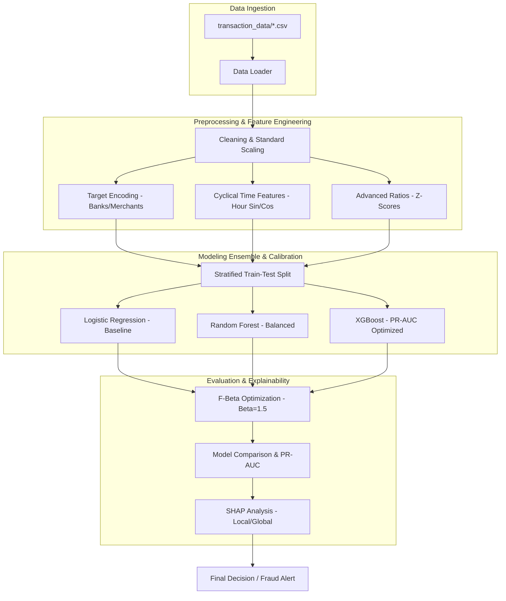
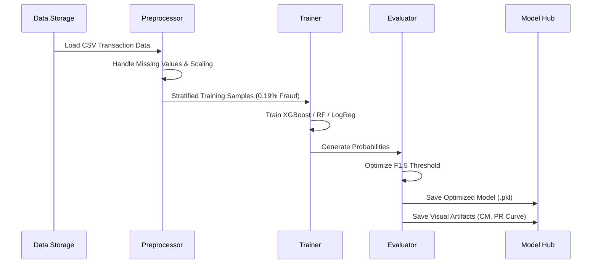
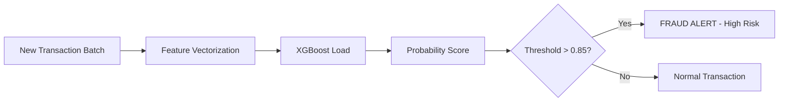

# 🛡️ UPI Fraud Detection System


## 📋 Overview

This project implements a robust, high-performance machine learning pipeline designed to detect fraud in **UPI (Unified Payments Interface)** transactions. Operating in a highly imbalanced environment (where fraud accounts for only **0.19%** of total volume), the system prioritizes **Recall** while maintaining a scalable alert volume using advanced thresholding and feature engineering.

### 🎯 Key Performance Goals
- **Maximize Recall**: Ensure high-risk fraudulent transactions are flagged even at the cost of some False Positives.
- **Precision Control**: Limit total alert volume using optimized decision thresholds.
- **Explainability**: Provide clear, actionable insights into *why* a transaction was flagged using **SHAP**.

---

## 🏛️ System Architecture

The following diagram illustrates the modular flow from raw transaction ingestion to final inference and interpretability.



---

## 🚀 Key Technical Components

### 1. High-Signal Feature Engineering
Traditional models often fail on UPI data due to its high volume and low signal. This pipeline creates custom behavioral features:
- **Amount Z-Scores**: Deviation of a transaction amount from a specific merchant's or bank's historical mean.
- **Cyclical Time**: Encoding transaction hours using Sine/Cosine transforms to capture 24-hour patterns.
- **Bank Intervals**: Flagging cross-bank vs. intra-bank transactions.
- **Nocturnal Risk**: Binary flags for high-amount transactions occurring between 10 PM and 6 AM.

### 2. Modeling Strategy
We utilize a multi-model approach to benchmark performance:
- **XGBoost**: Our primary champion model, tuned with `scale_pos_weight=100` to force attention on the rare fraud minority.
- **Random Forest**: Built with `balanced_subsample` class weighting for robustness.
- **Logistic Regression**: A reliable baseline for linear feature effectiveness.

### 3. Recall-Centric thresholding (F1.5 Score)
Instead of a default 0.5 threshold, we use a custom utility function that maximizes the **F1.5 score**, which weights Recall more heavily than Precision.
- **Constraint**: The system ensures that total alert volume does not exceed 10% of total transactions to avoid "alert fatigue" for fraud analysts.

---

## 🔁 Operational Flows

### 🧠 Training Flow


### ⚡ Batch Inference Flow


---

## 🔍 Interpretability with SHAP
We integrate **SHAP (SHapley Additive exPlanations)** to transform "black-box" models into transparent decision tools. 
- **Global Importance**: Understand which features (e.g., `amount_inr`, `hour_sin`) drive overall model performance.
- **Local Explanations**: For every flagged transaction, we provide a "Force Plot" showing which specific attributes pushed the score over the threshold.

---

## 🛠️ Setup & Execution

### Prerequisites
- Python 3.10+
- Virtual Environment (`venv`)

### Installation
```bash
# Clone the repository
git clone https://github.com/yourusername/upi-fraud-detection.git
cd upi-fraud-detection

# Install dependencies
pip install -r requirements.txt
```

### Usage
To run the full pipeline (preprocessing -> training -> visualization -> SHAP explanation):
```bash
python main.py
```

---

## 📈 Future Roadmap
- [ ] **Interaction Data Integration**: Incorporating user-to-user interaction graphs (Social Network Analysis).
- [ ] **Streaming Support**: Transitioning from batch processing to real-time Kafka-based ingestion.
- [ ] **Advanced Calibration**: Implementing Platt Scaling for better probability estimation.

---

